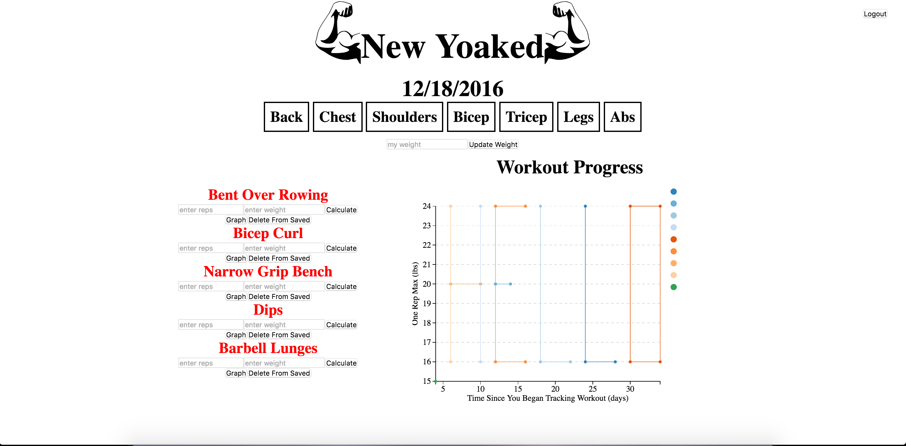
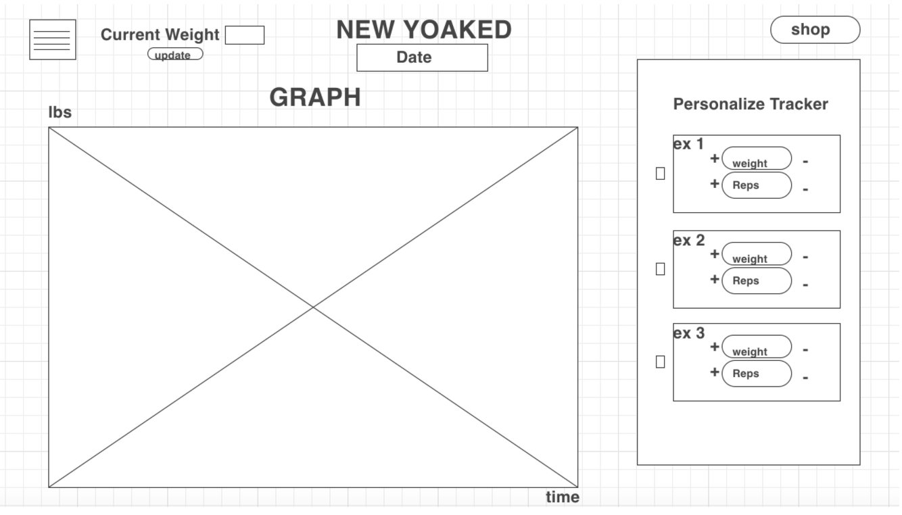
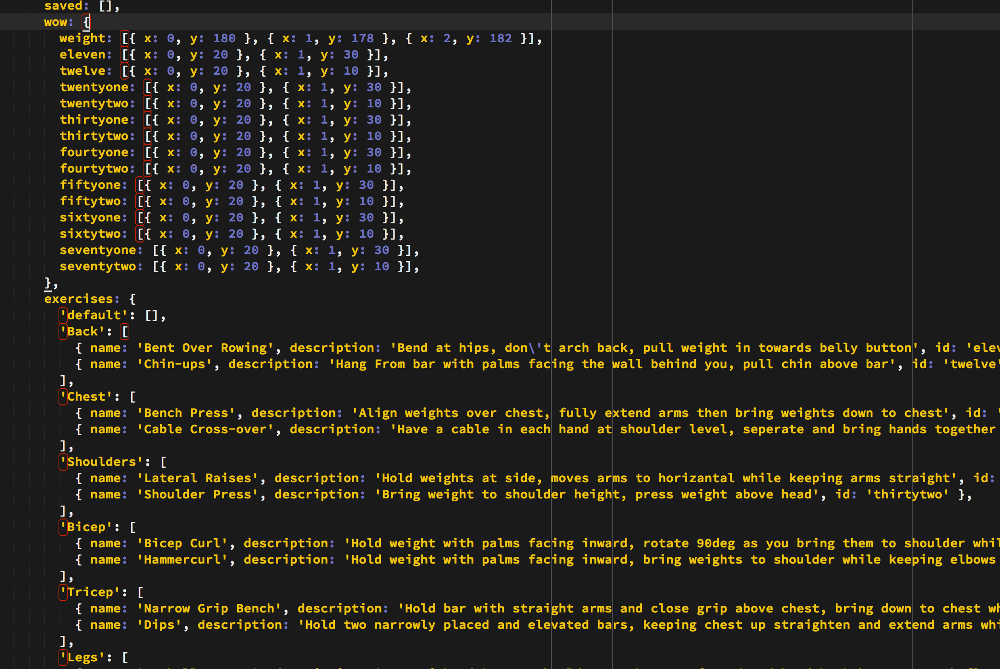

# New Yoaked

## Description

This is a React based exercise App allowing users to sign into their account, save their favorite workouts and track your workout progress over time.

## Functionality

As a User

- Get access to all the functionality of the App
- Sign Up or Login to your profile.
- Save your favorite workouts to your library.
- Update progress for your workouts and weight over time
- Since everyone using the App will be tracking their own personal data, users will be required to sign up and guests to the site will not be premitted.

## App Use

Once the user is signed in to their account, the user can select the type of exercis that their looking for and save it to their favorite exercise library. The user will then have the ability to enter the number of reps they did and the weight they used to calculate their one rep max (a data point calculated to find how much a user can lift if they only did one rep). Each user will be provided with their own personal database which saves their start date, favorite exercises and workout progress.

## My Approach With This Project

1. Set up MVC/ React framework
2. Install NPM package to allow D3 graph to display in React
3. Make my states that allow users to update their progress using minimal lines of code
4. Set up the routes
5. Create the database
6. Post and Get from the database
7. Login Authentication
8. Style the page

## Wireframe

## User Authentication

The user authentication is attributed to the template provided by Dan Pease. Though I made many changes to his, such as returning the user ID to render unique DB, the core of it was made by him. It uses tokens and sessions to provide login for users.

## Technologies Used

- Node
- Express
- SQL
- Javascript
- React
- D3

## Interesting Code

This snippit of code shows what part of my App.jsx is holding. The saved array is initially empty, but as users add information the array becomes populated with information of favorite exercises. The wow vaiable, while holding temp data now for the first 2 days, uses user information to populate the array which appear on the graph onclick. The exercises variable is where I hard code all the exercises user can choose from, where a state is passed when a muscel group is clicked, allowing different exercises to be rendered.

## Installation

If viewing this on Heroku, the app should work immediatly, all you need to do is make an account and start using it!

If you are forking it from github, in your terminal window do the command "npm install" to download all the packages needed to get this server to work and add a .env file with your personal information on it. Next create an SQL database and impliment the schema.sql. Open up two terminal windows and put command "nodemon" in one and "npm run watch" in the other. Finally type localhost:3000 into the browser and log into your account!

## Sources

- Dan Pease for his user Auth
- Rafa for debugging part of my code
- http://stackoverflow.com/questions/2627473/how-to-calculate-the-number-of-days-between-two-dates-using-javascript 
for thier day counter
- http://stackoverflow.com/questions/1531093/how-to-get-current-date-in-javascript
for getting the current day

## Hurdles

- Deploying on Heroku
- setting sates
- Figuring out how to store data in db and get it back
- Stringifying saved variable before putting it into DB
- UserAuth
- Accomplishing everything that I wanted to in this amount of time

## Still to accomplish

- one db per user
- overflow y for library and exercises (flex top too for that side)
- add more exercised
- add colors/ a little more spacing
- add multi lines to db, and also remove multi lines
- start with no data in graphs
- put 2 buttons into 1

## To View

https://new-yoaked.herokuapp.com/

- the most current version has not been hoisted tho, still working on improvements
